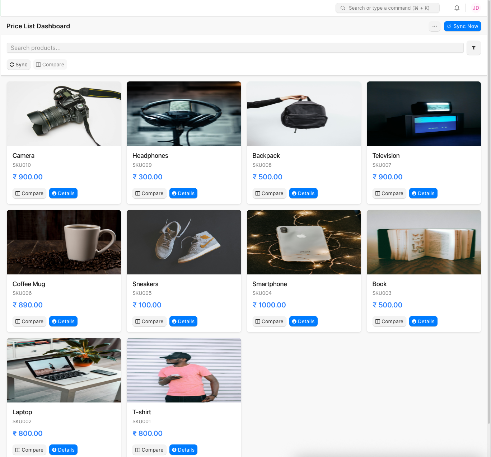

# Mobile Price List

> A powerful mobile-first price list application for Frappe/ERPNext that enables sales teams to access product information on the go, even when offline.


*Mobile Price List application running on smartphone devices*

## Features

- **Mobile Optimized UI**: Responsive design works on any device
- **Offline Capability**: Access price lists even without internet connection
- **PWA Support**: Install on mobile home screen for app-like experience
- **Product Comparison**: Compare specifications across multiple products
- **Price History**: Track and display price changes over time
- **Real-time Sync**: Automatically synchronize data when online

## Business Benefits

- Empower field sales teams with up-to-date pricing information
- Reduce sales errors with offline access to accurate pricing
- Improve customer experience with quick product comparisons
- Streamline sales process with mobile-friendly product search and filtering

## Screenshots

<details>
<summary>View Application Screenshots</summary>
<br>

</details>

## Installation

You can install this app using the [bench](https://github.com/frappe/bench) CLI:

```bash
cd $PATH_TO_YOUR_BENCH
bench get-app https://github.com/arkone-software/price-list --branch main
bench install-app price_list
```

## Configuration

1. After installation, navigate to "Price List Dashboard" in your ERPNext instance
2. Configure the default price list to display
3. Grant appropriate user permissions

## Usage

1. Access the price list dashboard from a mobile device
2. Browse products by category or search by name/code
3. Compare products by selecting up to three items
4. View product details including specifications and stock availability
5. Works offline automatically - changes sync when back online

## Requirements

- Frappe/ERPNext v14+
- Modern web browser with JavaScript enabled
- For PWA functionality: HTTPS-enabled domain

## Contributing

This app uses `pre-commit` for code formatting and linting. Please [install pre-commit](https://pre-commit.com/#installation) and enable it for this repository:

```bash
cd apps/price_list
pre-commit install
```

Pre-commit is configured to use the following tools for checking and formatting your code:

- ruff
- eslint
- prettier
- pyupgrade

## Support

For bugs and feature requests, please [create an issue](https://github.com/arkone-software/price-list/issues) on GitHub.

For commercial support and customization, please contact [ArkOne Software](https://www.arkone.dev) - specialists in Frappe/ERPNext development and mobile application solutions.

## License

This application is licensed under the [GNU Affero General Public License v3.0](LICENSE).

---

<p align="center">
  <a href="https://www.arkone.dev">
    
    <br>
    <em>Developed with ❤️ by ArkOne Software - Enterprise ERPNext Solutions</em>
  </a>
</p>
